# [📈 Live Status](https://demo.upptime.js.org): <!--live status--> **🟧 Partial outage**

This repository contains the open-source uptime monitor and status page for [serversshnet](https://status.mainssh.com), powered by [Upptime](https://github.com/upptime/upptime).

<!--start: status pages-->
<!-- This summary is generated by Upptime (https://github.com/upptime/upptime) -->
<!-- Do not edit this manually, your changes will be overwritten -->
<!-- prettier-ignore -->
| URL | Status | History | Response Time | Uptime |
| --- | ------ | ------- | ------------- | ------ |
|  [dedns.mainssh.xyz](dedns.mainssh.xyz) | 🟥 Down | [dedns-mainssh-xyz.yml](https://github.com/serversshnet/status-mainssh.com/commits/HEAD/history/dedns-mainssh-xyz.yml) | 

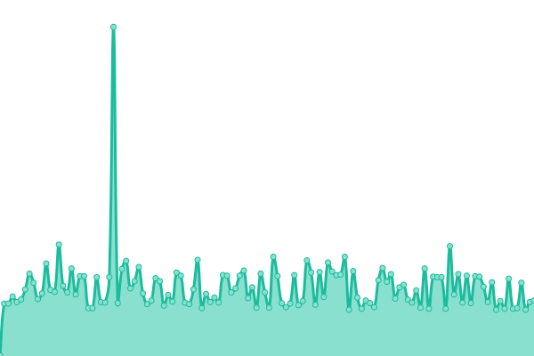 315ms
     
 | 

<a href="https://status.mainssh.com/history/dedns-mainssh-xyz">1.01%</a>
    

|  [usdns.mainssh.xyz](usdns.mainssh.xyz) | 🟩 Up | [usdns-mainssh-xyz.yml](https://github.com/serversshnet/status-mainssh.com/commits/HEAD/history/usdns-mainssh-xyz.yml) | 

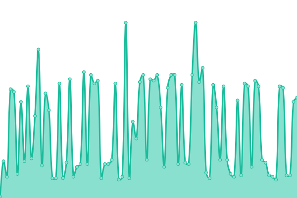 57ms
     
 | 

<a href="https://status.mainssh.com/history/usdns-mainssh-xyz">84.52%</a>
    

|  [frdns.mainssh.xyz](frdns.mainssh.xyz) | 🟩 Up | [frdns-mainssh-xyz.yml](https://github.com/serversshnet/status-mainssh.com/commits/HEAD/history/frdns-mainssh-xyz.yml) | 

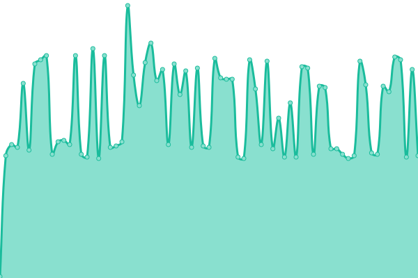 175ms
     
 | 

<a href="https://status.mainssh.com/history/frdns-mainssh-xyz">25.79%</a>
    

|  [cadns.mainssh.xyz](cadns.mainssh.xyz) | 🟩 Up | [cadns-mainssh-xyz.yml](https://github.com/serversshnet/status-mainssh.com/commits/HEAD/history/cadns-mainssh-xyz.yml) | 

 126ms
     
 | 

<a href="https://status.mainssh.com/history/cadns-mainssh-xyz">99.41%</a>
    

|  [sg2dns.mainssh.xyz](sg2dns.mainssh.xyz) | 🟩 Up | [sg2dns-mainssh-xyz.yml](https://github.com/serversshnet/status-mainssh.com/commits/HEAD/history/sg2dns-mainssh-xyz.yml) | 

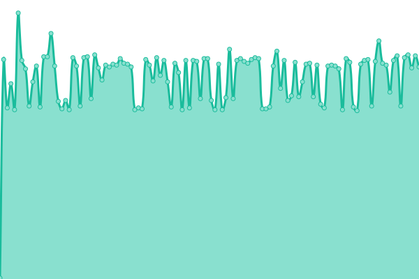 219ms
     
 | 

<a href="https://status.mainssh.com/history/sg2dns-mainssh-xyz">84.71%</a>
    

|  [sg1dns.mainssh.xyz](sg1dns.mainssh.xyz) | 🟩 Up | [sg1dns-mainssh-xyz.yml](https://github.com/serversshnet/status-mainssh.com/commits/HEAD/history/sg1dns-mainssh-xyz.yml) | 

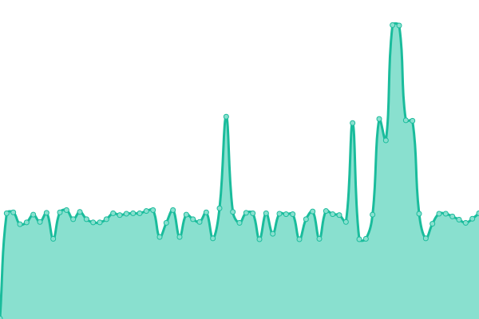 222ms
     
 | 

<a href="https://status.mainssh.com/history/sg1dns-mainssh-xyz">90.89%</a>
    

|  [gewg.mainssh.com](gewg.mainssh.com) | 🟩 Up | [gewg-mainssh-com.yml](https://github.com/serversshnet/status-mainssh.com/commits/HEAD/history/gewg-mainssh-com.yml) | 

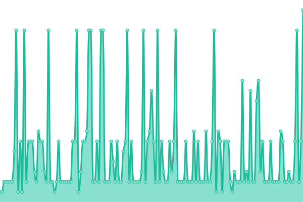 151ms
     
 | 

<a href="https://status.mainssh.com/history/gewg-mainssh-com">91.57%</a>
    

|  [cawg.mainssh.com](cawg.mainssh.com) | 🟥 Down | [cawg-mainssh-com.yml](https://github.com/serversshnet/status-mainssh.com/commits/HEAD/history/cawg-mainssh-com.yml) | 

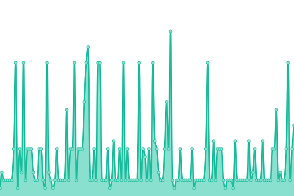 0ms
     
 | 

<a href="https://status.mainssh.com/history/cawg-mainssh-com">0.00%</a>
    

|  [sg2wg.mainssh.com](sg2wg.mainssh.com) | 🟩 Up | [sg2wg-mainssh-com.yml](https://github.com/serversshnet/status-mainssh.com/commits/HEAD/history/sg2wg-mainssh-com.yml) | 

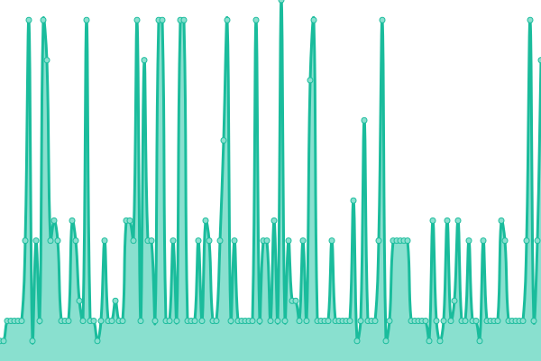 220ms
     
 | 

<a href="https://status.mainssh.com/history/sg2wg-mainssh-com">84.73%</a>
    

|  [sg1wg.mainssh.com](sg1wg.mainssh.com) | 🟩 Up | [sg1wg-mainssh-com.yml](https://github.com/serversshnet/status-mainssh.com/commits/HEAD/history/sg1wg-mainssh-com.yml) | 

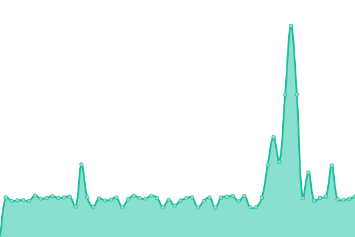 223ms
     
 | 

<a href="https://status.mainssh.com/history/sg1wg-mainssh-com">90.89%</a>
    

|  [idwg.mainssh.com](idwg.mainssh.com) | 🟩 Up | [idwg-mainssh-com.yml](https://github.com/serversshnet/status-mainssh.com/commits/HEAD/history/idwg-mainssh-com.yml) | 

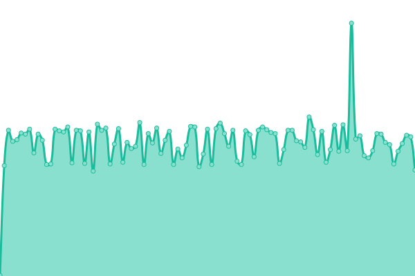 230ms
     
 | 

<a href="https://status.mainssh.com/history/idwg-mainssh-com">97.28%</a>
    

|  [frwg.mainssh.com](frwg.mainssh.com) | 🟥 Down | [frwg-mainssh-com.yml](https://github.com/serversshnet/status-mainssh.com/commits/HEAD/history/frwg-mainssh-com.yml) | 

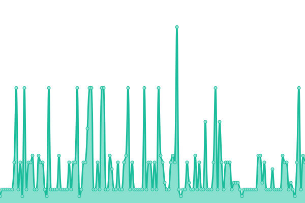 0ms
     
 | 

<a href="https://status.mainssh.com/history/frwg-mainssh-com">0.00%</a>
    

|  [usx.mainssh.com](usx.mainssh.com) | 🟩 Up | [usx-mainssh-com.yml](https://github.com/serversshnet/status-mainssh.com/commits/HEAD/history/usx-mainssh-com.yml) | 

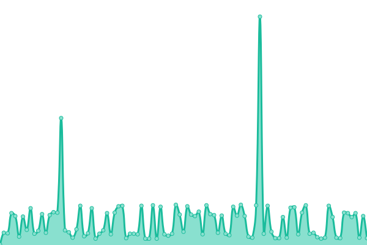 49ms
     
 | 

<a href="https://status.mainssh.com/history/usx-mainssh-com">99.85%</a>
    

|  [ustgrpc.mainssh.xyz](ustgrpc.mainssh.xyz) | 🟩 Up | [ustgrpc-mainssh-xyz.yml](https://github.com/serversshnet/status-mainssh.com/commits/HEAD/history/ustgrpc-mainssh-xyz.yml) | 

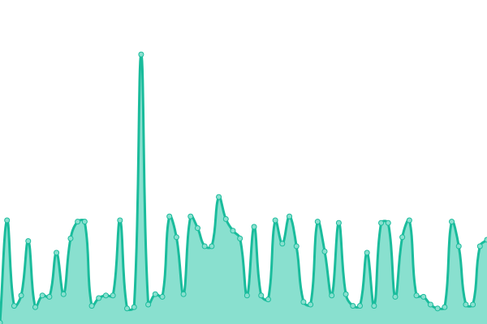 66ms
     
 | 

<a href="https://status.mainssh.com/history/ustgrpc-mainssh-xyz">84.20%</a>
    

|  [ustws.mainssh.xyz](ustws.mainssh.xyz) | 🟩 Up | [ustws-mainssh-xyz.yml](https://github.com/serversshnet/status-mainssh.com/commits/HEAD/history/ustws-mainssh-xyz.yml) | 

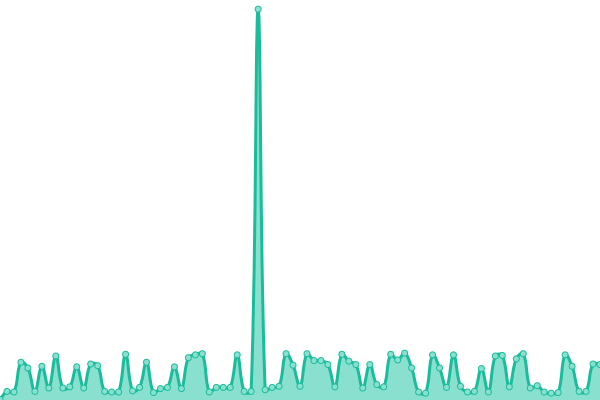 50ms
     
 | 

<a href="https://status.mainssh.com/history/ustws-mainssh-xyz">84.39%</a>
    

|  [ustcp.mainssh.xyz](ustcp.mainssh.xyz) | 🟩 Up | [ustcp-mainssh-xyz.yml](https://github.com/serversshnet/status-mainssh.com/commits/HEAD/history/ustcp-mainssh-xyz.yml) | 

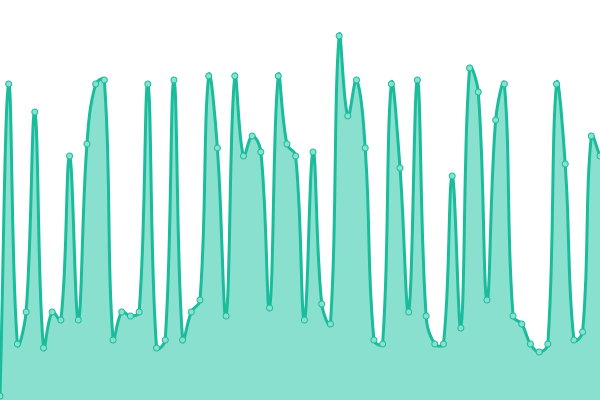 47ms
     
 | 

<a href="https://status.mainssh.com/history/ustcp-mainssh-xyz">84.42%</a>
    

|  [uslgrpc.mainssh.xyz](uslgrpc.mainssh.xyz) | 🟩 Up | [uslgrpc-mainssh-xyz.yml](https://github.com/serversshnet/status-mainssh.com/commits/HEAD/history/uslgrpc-mainssh-xyz.yml) | 

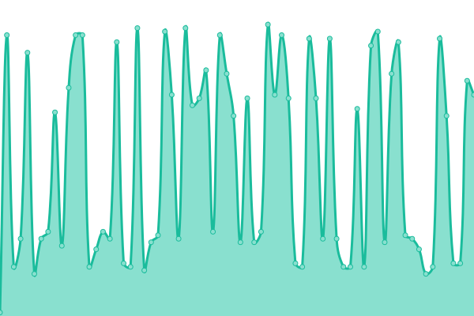 48ms
     
 | 

<a href="https://status.mainssh.com/history/uslgrpc-mainssh-xyz">84.53%</a>
    

|  [uslws.mainssh.xyz](uslws.mainssh.xyz) | 🟩 Up | [uslws-mainssh-xyz.yml](https://github.com/serversshnet/status-mainssh.com/commits/HEAD/history/uslws-mainssh-xyz.yml) | 

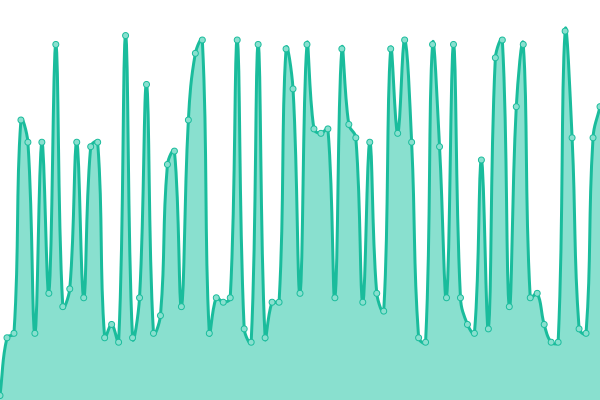 49ms
     
 | 

<a href="https://status.mainssh.com/history/uslws-mainssh-xyz">84.57%</a>
    

|  [usmws.mainssh.xyz](usmws.mainssh.xyz) | 🟩 Up | [usmws-mainssh-xyz.yml](https://github.com/serversshnet/status-mainssh.com/commits/HEAD/history/usmws-mainssh-xyz.yml) | 

 53ms
     
 | 

<a href="https://status.mainssh.com/history/usmws-mainssh-xyz">84.60%</a>
    

|  [usmgrpc.mainssh.xyz](usmgrpc.mainssh.xyz) | 🟩 Up | [usmgrpc-mainssh-xyz.yml](https://github.com/serversshnet/status-mainssh.com/commits/HEAD/history/usmgrpc-mainssh-xyz.yml) | 

 52ms
     
 | 

<a href="https://status.mainssh.com/history/usmgrpc-mainssh-xyz">84.64%</a>
    

|  [cam.mainssh.com](cam.mainssh.com) | 🟥 Down | [cam-mainssh-com.yml](https://github.com/serversshnet/status-mainssh.com/commits/HEAD/history/cam-mainssh-com.yml) | 

 0ms
     
 | 

<a href="https://status.mainssh.com/history/cam-mainssh-com">0.00%</a>
    

|  [frm.mainssh.com](frm.mainssh.com) | 🟥 Down | [frm-mainssh-com.yml](https://github.com/serversshnet/status-mainssh.com/commits/HEAD/history/frm-mainssh-com.yml) | 

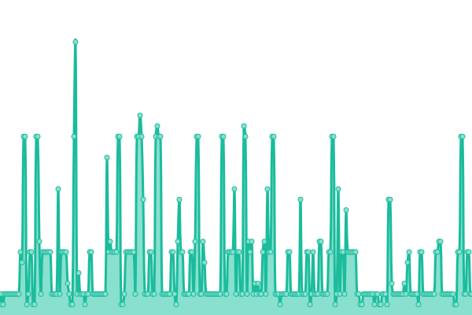 0ms
     
 | 

<a href="https://status.mainssh.com/history/frm-mainssh-com">0.00%</a>
    

|  [dem.mainssh.com](dem.mainssh.com) | 🟥 Down | [dem-mainssh-com.yml](https://github.com/serversshnet/status-mainssh.com/commits/HEAD/history/dem-mainssh-com.yml) | 

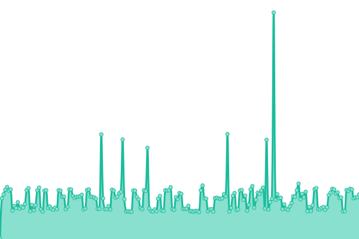 158ms
     
 | 

<a href="https://status.mainssh.com/history/dem-mainssh-com">97.36%</a>
    

|  [sgx3.mainssh.com](sgx3.mainssh.com) | 🟩 Up | [sgx3-mainssh-com.yml](https://github.com/serversshnet/status-mainssh.com/commits/HEAD/history/sgx3-mainssh-com.yml) | 

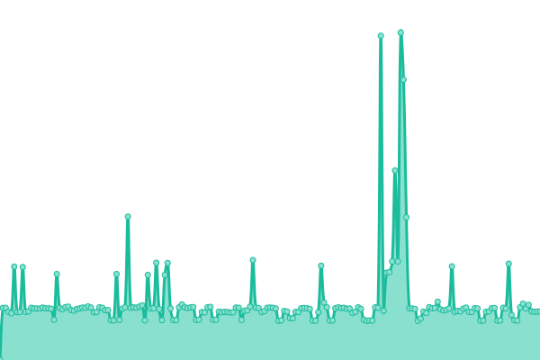 216ms
     
 | 

<a href="https://status.mainssh.com/history/sgx3-mainssh-com">99.96%</a>
    

|  [sgx4.mainssh.com](sgx4.mainssh.com) | 🟩 Up | [sgx4-mainssh-com.yml](https://github.com/serversshnet/status-mainssh.com/commits/HEAD/history/sgx4-mainssh-com.yml) | 

 220ms
     
 | 

<a href="https://status.mainssh.com/history/sgx4-mainssh-com">100.00%</a>
    

|  [sgx5.mainssh.com](sgx5.mainssh.com) | 🟥 Down | [sgx5-mainssh-com.yml](https://github.com/serversshnet/status-mainssh.com/commits/HEAD/history/sgx5-mainssh-com.yml) | 

 0ms
     
 | 

<a href="https://status.mainssh.com/history/sgx5-mainssh-com">0.00%</a>
    

|  [sgx5.mainssh.com](sgx5.mainssh.com) | 🟥 Down | [sgx5-mainssh-com.yml](https://github.com/serversshnet/status-mainssh.com/commits/HEAD/history/sgx5-mainssh-com.yml) | 

 0ms
     
 | 

<a href="https://status.mainssh.com/history/sgx5-mainssh-com">0.00%</a>
    

|  [sgx4.mainssh.com](sgx4.mainssh.com) | 🟩 Up | [sgx4-mainssh-com.yml](https://github.com/serversshnet/status-mainssh.com/commits/HEAD/history/sgx4-mainssh-com.yml) | 

 220ms
     
 | 

<a href="https://status.mainssh.com/history/sgx4-mainssh-com">100.00%</a>
    

|  [sgm4.mainssh.com](sgm4.mainssh.com) | 🟥 Down | [sgm4-mainssh-com.yml](https://github.com/serversshnet/status-mainssh.com/commits/HEAD/history/sgm4-mainssh-com.yml) | 

 0ms
     
 | 

<a href="https://status.mainssh.com/history/sgm4-mainssh-com">100.00%</a>
    

|  [uklws.mainssh.xyz](uklws.mainssh.xyz) | 🟩 Up | [uklws-mainssh-xyz.yml](https://github.com/serversshnet/status-mainssh.com/commits/HEAD/history/uklws-mainssh-xyz.yml) | 

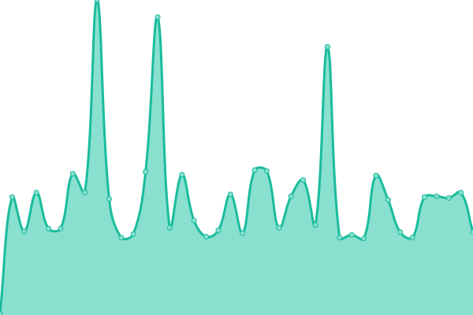 122ms
     
 | 

<a href="https://status.mainssh.com/history/uklws-mainssh-xyz">96.86%</a>
    

|  [hklws.mainssh.xyz](hklws.mainssh.xyz) | 🟩 Up | [hklws-mainssh-xyz.yml](https://github.com/serversshnet/status-mainssh.com/commits/HEAD/history/hklws-mainssh-xyz.yml) | 

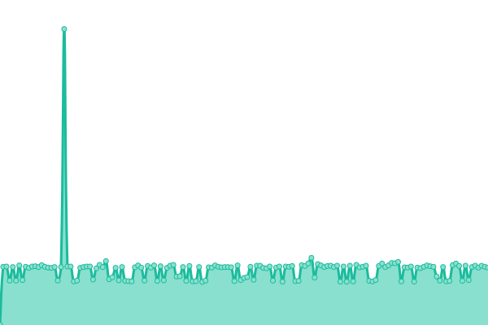 216ms
     
 | 

<a href="https://status.mainssh.com/history/hklws-mainssh-xyz">0.00%</a>
    

|  [gelws.mainssh.xyz](gelws.mainssh.xyz) | 🟥 Down | [gelws-mainssh-xyz.yml](https://github.com/serversshnet/status-mainssh.com/commits/HEAD/history/gelws-mainssh-xyz.yml) | 

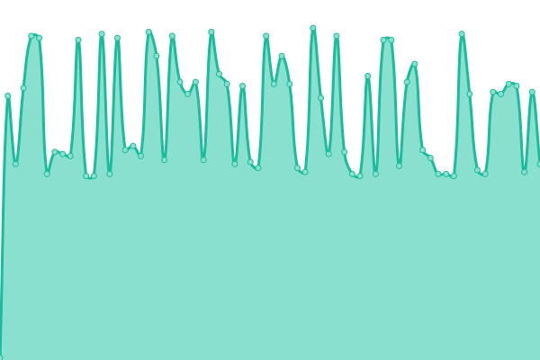 149ms
     
 | 

<a href="https://status.mainssh.com/history/gelws-mainssh-xyz">1.23%</a>
    

|  [frlws.mainssh.xyz](frlws.mainssh.xyz) | 🟩 Up | [frlws-mainssh-xyz.yml](https://github.com/serversshnet/status-mainssh.com/commits/HEAD/history/frlws-mainssh-xyz.yml) | 

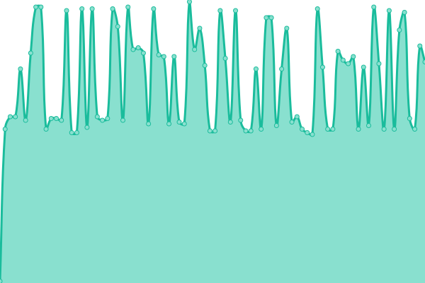 222ms
     
 | 

<a href="https://status.mainssh.com/history/frlws-mainssh-xyz">42.60%</a>
    

|  [idlws.mainssh.xyz](idlws.mainssh.xyz) | 🟩 Up | [idlws-mainssh-xyz.yml](https://github.com/serversshnet/status-mainssh.com/commits/HEAD/history/idlws-mainssh-xyz.yml) | 

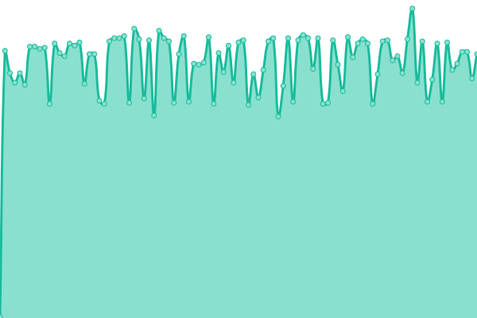 232ms
     
 | 

<a href="https://status.mainssh.com/history/idlws-mainssh-xyz">97.30%</a>
    

|  [sg3lws.mainssh.xyz](sg3lws.mainssh.xyz) | 🟩 Up | [sg3lws-mainssh-xyz.yml](https://github.com/serversshnet/status-mainssh.com/commits/HEAD/history/sg3lws-mainssh-xyz.yml) | 

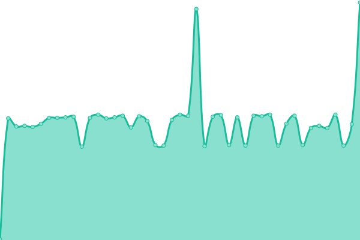 228ms
     
 | 

<a href="https://status.mainssh.com/history/sg3lws-mainssh-xyz">93.00%</a>
    

|  [sg2lws.mainssh.xyz](sg2lws.mainssh.xyz) | 🟩 Up | [sg2lws-mainssh-xyz.yml](https://github.com/serversshnet/status-mainssh.com/commits/HEAD/history/sg2lws-mainssh-xyz.yml) | 

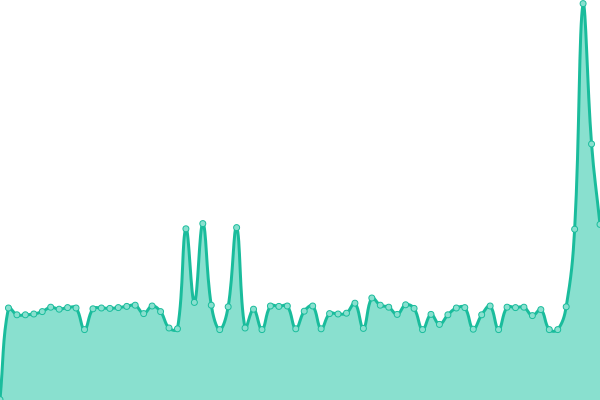 218ms
     
 | 

<a href="https://status.mainssh.com/history/sg2lws-mainssh-xyz">84.75%</a>
    

|  [sglws.mainssh.xyz](sglws.mainssh.xyz) | 🟩 Up | [sglws-mainssh-xyz.yml](https://github.com/serversshnet/status-mainssh.com/commits/HEAD/history/sglws-mainssh-xyz.yml) | 

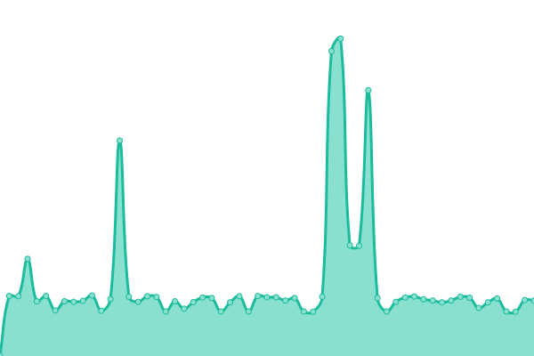 217ms
     
 | 

<a href="https://status.mainssh.com/history/sglws-mainssh-xyz">90.92%</a>
    

|  [calws.mainssh.xyz](calws.mainssh.xyz) | 🟩 Up | [calws-mainssh-xyz.yml](https://github.com/serversshnet/status-mainssh.com/commits/HEAD/history/calws-mainssh-xyz.yml) | 

 113ms
     
 | 

<a href="https://status.mainssh.com/history/calws-mainssh-xyz">99.30%</a>
    

|  [sgx3.mainssh.com](sgx3.mainssh.com) | 🟩 Up | [sgx3-mainssh-com.yml](https://github.com/serversshnet/status-mainssh.com/commits/HEAD/history/sgx3-mainssh-com.yml) | 

 216ms
     
 | 

<a href="https://status.mainssh.com/history/sgx3-mainssh-com">99.96%</a>
    

|  [sgx2.mainssh.com](sgx2.mainssh.com) | 🟩 Up | [sgx2-mainssh-com.yml](https://github.com/serversshnet/status-mainssh.com/commits/HEAD/history/sgx2-mainssh-com.yml) | 

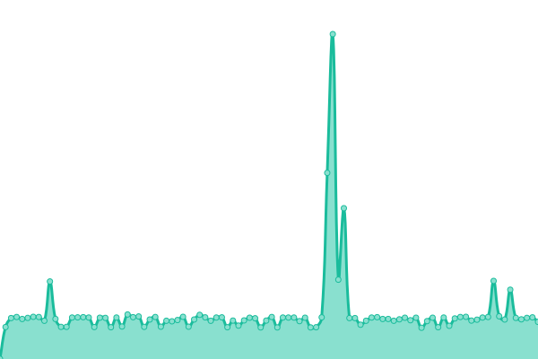 218ms
     
 | 

<a href="https://status.mainssh.com/history/sgx2-mainssh-com">0.00%</a>
    

|  [sgx1.mainssh.com](sgx1.mainssh.com) | 🟩 Up | [sgx1-mainssh-com.yml](https://github.com/serversshnet/status-mainssh.com/commits/HEAD/history/sgx1-mainssh-com.yml) | 

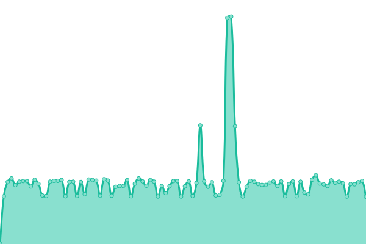 221ms
     
 | 

<a href="https://status.mainssh.com/history/sgx1-mainssh-com">2.87%</a>
    

|  [getgrpc.mainssh.xyz](getgrpc.mainssh.xyz) | 🟥 Down | [getgrpc-mainssh-xyz.yml](https://github.com/serversshnet/status-mainssh.com/commits/HEAD/history/getgrpc-mainssh-xyz.yml) | 

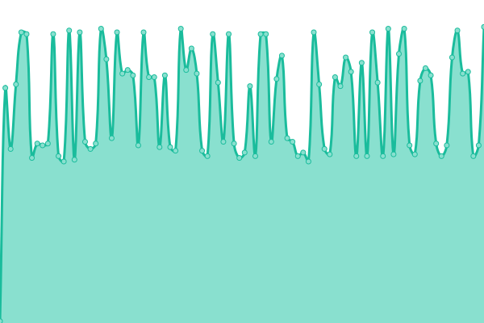 352ms
     
 | 

<a href="https://status.mainssh.com/history/getgrpc-mainssh-xyz">1.22%</a>
    

|  [getws.mainssh.xyz](getws.mainssh.xyz) | 🟥 Down | [getws-mainssh-xyz.yml](https://github.com/serversshnet/status-mainssh.com/commits/HEAD/history/getws-mainssh-xyz.yml) | 

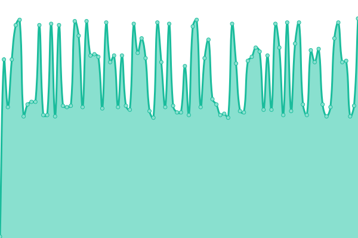 149ms
     
 | 

<a href="https://status.mainssh.com/history/getws-mainssh-xyz">1.22%</a>
    

|  [getcp.mainssh.xyz](getcp.mainssh.xyz) | 🟥 Down | [getcp-mainssh-xyz.yml](https://github.com/serversshnet/status-mainssh.com/commits/HEAD/history/getcp-mainssh-xyz.yml) | 

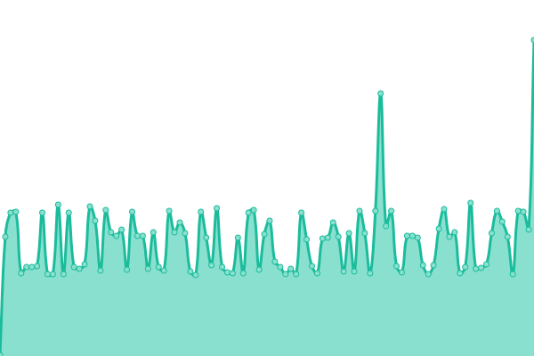 154ms
     
 | 

<a href="https://status.mainssh.com/history/getcp-mainssh-xyz">1.22%</a>
    

|  [gemws.mainssh.xyz](gemws.mainssh.xyz) | 🟥 Down | [gemws-mainssh-xyz.yml](https://github.com/serversshnet/status-mainssh.com/commits/HEAD/history/gemws-mainssh-xyz.yml) | 

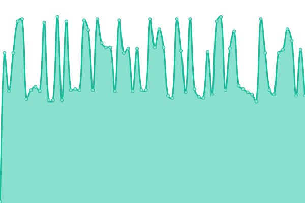 355ms
     
 | 

<a href="https://status.mainssh.com/history/gemws-mainssh-xyz">1.22%</a>
    

|  [gelgrpc.mainssh.xyz](gelgrpc.mainssh.xyz) | 🟥 Down | [gelgrpc-mainssh-xyz.yml](https://github.com/serversshnet/status-mainssh.com/commits/HEAD/history/gelgrpc-mainssh-xyz.yml) | 

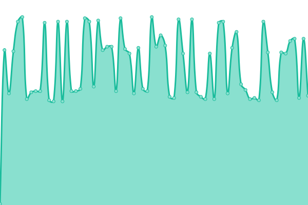 148ms
     
 | 

<a href="https://status.mainssh.com/history/gelgrpc-mainssh-xyz">1.22%</a>
    

|  [gemgrpc.mainssh.xyz](gemgrpc.mainssh.xyz) | 🟥 Down | [gemgrpc-mainssh-xyz.yml](https://github.com/serversshnet/status-mainssh.com/commits/HEAD/history/gemgrpc-mainssh-xyz.yml) | 

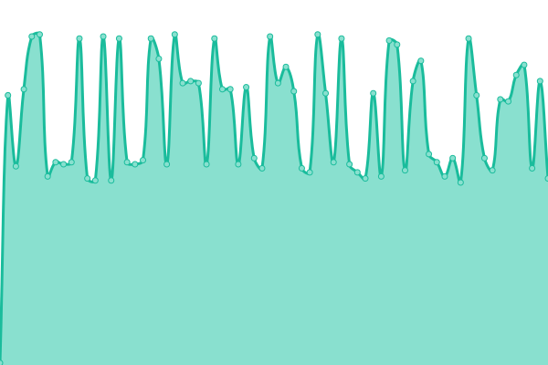 348ms
     
 | 

<a href="https://status.mainssh.com/history/gemgrpc-mainssh-xyz">1.22%</a>
    

|  [uktgrpc.mainssh.xyz](uktgrpc.mainssh.xyz) | 🟩 Up | [uktgrpc-mainssh-xyz.yml](https://github.com/serversshnet/status-mainssh.com/commits/HEAD/history/uktgrpc-mainssh-xyz.yml) | 

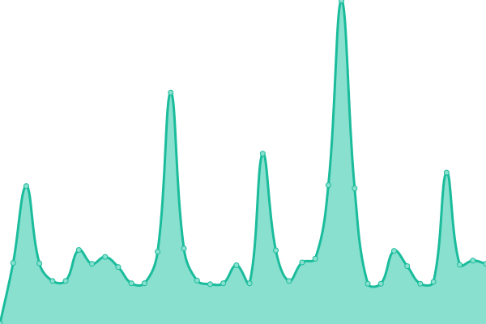 120ms
     
 | 

<a href="https://status.mainssh.com/history/uktgrpc-mainssh-xyz">96.87%</a>
    

|  [uktws.mainssh.xyz](uktws.mainssh.xyz) | 🟩 Up | [uktws-mainssh-xyz.yml](https://github.com/serversshnet/status-mainssh.com/commits/HEAD/history/uktws-mainssh-xyz.yml) | 

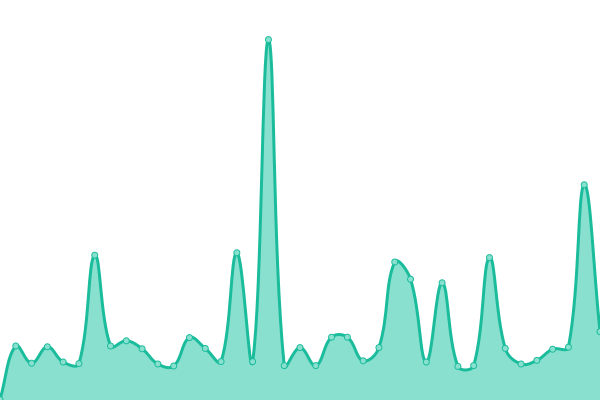 121ms
     
 | 

<a href="https://status.mainssh.com/history/uktws-mainssh-xyz">96.88%</a>
    

|  [uktcp.mainssh.xyz](uktcp.mainssh.xyz) | 🟩 Up | [uktcp-mainssh-xyz.yml](https://github.com/serversshnet/status-mainssh.com/commits/HEAD/history/uktcp-mainssh-xyz.yml) | 

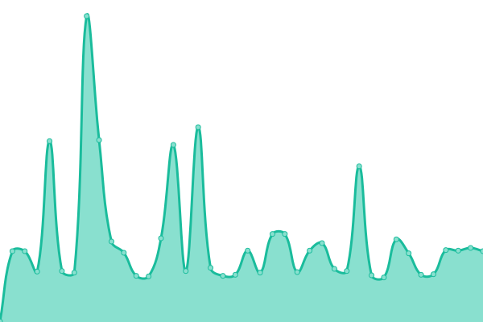 125ms
     
 | 

<a href="https://status.mainssh.com/history/uktcp-mainssh-xyz">96.90%</a>
    

|  [ukmws.mainssh.xyz](ukmws.mainssh.xyz) | 🟩 Up | [ukmws-mainssh-xyz.yml](https://github.com/serversshnet/status-mainssh.com/commits/HEAD/history/ukmws-mainssh-xyz.yml) | 

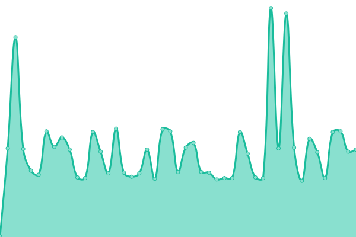 123ms
     
 | 

<a href="https://status.mainssh.com/history/ukmws-mainssh-xyz">96.91%</a>
    

|  [uklgrpc.mainssh.xyz](uklgrpc.mainssh.xyz) | 🟩 Up | [uklgrpc-mainssh-xyz.yml](https://github.com/serversshnet/status-mainssh.com/commits/HEAD/history/uklgrpc-mainssh-xyz.yml) | 

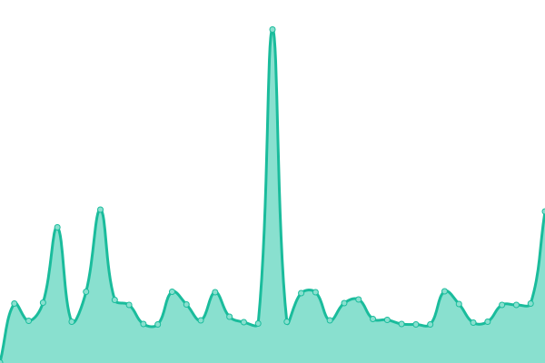 122ms
     
 | 

<a href="https://status.mainssh.com/history/uklgrpc-mainssh-xyz">96.92%</a>
    

|  [ukmgrpc.mainssh.xyz](ukmgrpc.mainssh.xyz) | 🟩 Up | [ukmgrpc-mainssh-xyz.yml](https://github.com/serversshnet/status-mainssh.com/commits/HEAD/history/ukmgrpc-mainssh-xyz.yml) | 

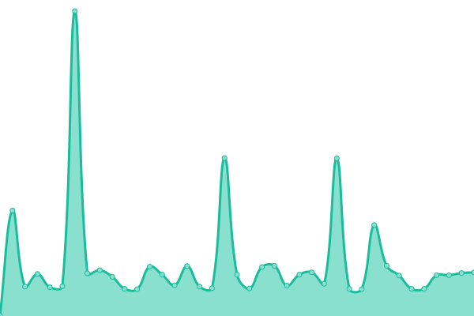 120ms
     
 | 

<a href="https://status.mainssh.com/history/ukmgrpc-mainssh-xyz">96.93%</a>
    

|  [catgrpc.mainssh.xyz](catgrpc.mainssh.xyz) | 🟩 Up | [catgrpc-mainssh-xyz.yml](https://github.com/serversshnet/status-mainssh.com/commits/HEAD/history/catgrpc-mainssh-xyz.yml) | 

 113ms
     
 | 

<a href="https://status.mainssh.com/history/catgrpc-mainssh-xyz">95.70%</a>
    

|  [catws.mainssh.xyz](catws.mainssh.xyz) | 🟩 Up | [catws-mainssh-xyz.yml](https://github.com/serversshnet/status-mainssh.com/commits/HEAD/history/catws-mainssh-xyz.yml) | 

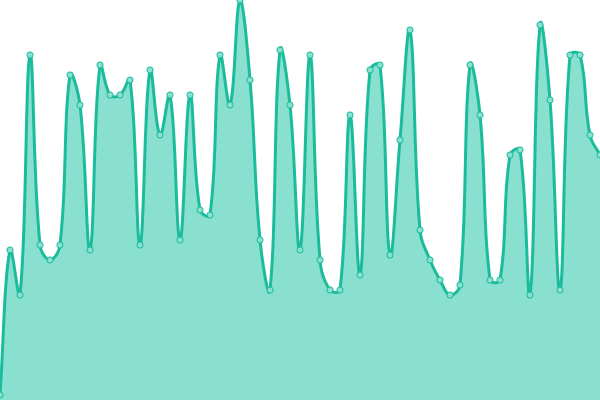 117ms
     
 | 

<a href="https://status.mainssh.com/history/catws-mainssh-xyz">99.57%</a>
    

|  [catcp.mainssh.xyz](catcp.mainssh.xyz) | 🟩 Up | [catcp-mainssh-xyz.yml](https://github.com/serversshnet/status-mainssh.com/commits/HEAD/history/catcp-mainssh-xyz.yml) | 

 103ms
     
 | 

<a href="https://status.mainssh.com/history/catcp-mainssh-xyz">99.80%</a>
    

|  [camws.mainssh.xyz](camws.mainssh.xyz) | 🟩 Up | [camws-mainssh-xyz.yml](https://github.com/serversshnet/status-mainssh.com/commits/HEAD/history/camws-mainssh-xyz.yml) | 

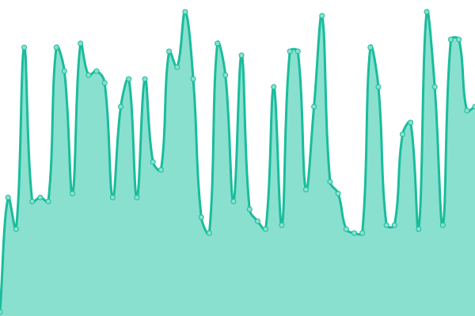 107ms
     
 | 

<a href="https://status.mainssh.com/history/camws-mainssh-xyz">100.00%</a>
    

|  [calgrpc.mainssh.xyz](calgrpc.mainssh.xyz) | 🟩 Up | [calgrpc-mainssh-xyz.yml](https://github.com/serversshnet/status-mainssh.com/commits/HEAD/history/calgrpc-mainssh-xyz.yml) | 

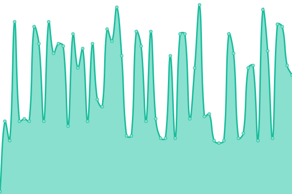 125ms
     
 | 

<a href="https://status.mainssh.com/history/calgrpc-mainssh-xyz">74.96%</a>
    

|  [camgrpc.mainssh.xyz](camgrpc.mainssh.xyz) | 🟩 Up | [camgrpc-mainssh-xyz.yml](https://github.com/serversshnet/status-mainssh.com/commits/HEAD/history/camgrpc-mainssh-xyz.yml) | 

 119ms
     
 | 

<a href="https://status.mainssh.com/history/camgrpc-mainssh-xyz">74.96%</a>
    

|  [frtgrpc.mainssh.xyz](frtgrpc.mainssh.xyz) | 🟩 Up | [frtgrpc-mainssh-xyz.yml](https://github.com/serversshnet/status-mainssh.com/commits/HEAD/history/frtgrpc-mainssh-xyz.yml) | 

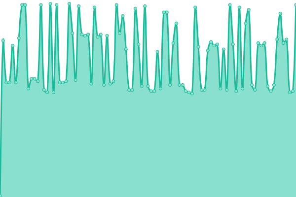 180ms
     
 | 

<a href="https://status.mainssh.com/history/frtgrpc-mainssh-xyz">70.39%</a>
    

|  [frtws.mainssh.xyz](frtws.mainssh.xyz) | 🟩 Up | [frtws-mainssh-xyz.yml](https://github.com/serversshnet/status-mainssh.com/commits/HEAD/history/frtws-mainssh-xyz.yml) | 

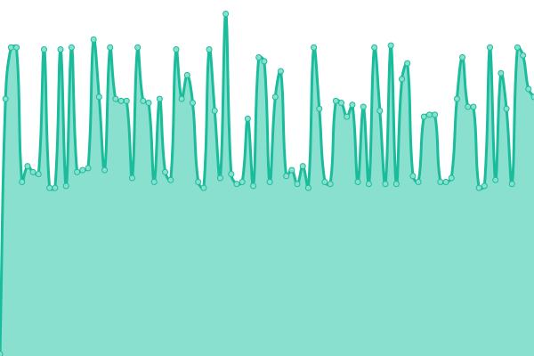 190ms
     
 | 

<a href="https://status.mainssh.com/history/frtws-mainssh-xyz">73.69%</a>
    

|  [frtcp.mainssh.xyz](frtcp.mainssh.xyz) | 🟩 Up | [frtcp-mainssh-xyz.yml](https://github.com/serversshnet/status-mainssh.com/commits/HEAD/history/frtcp-mainssh-xyz.yml) | 

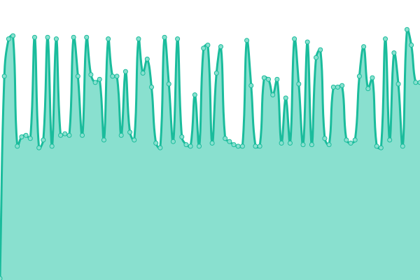 178ms
     
 | 

<a href="https://status.mainssh.com/history/frtcp-mainssh-xyz">98.76%</a>
    

|  [frmws.mainssh.xyz](frmws.mainssh.xyz) | 🟩 Up | [frmws-mainssh-xyz.yml](https://github.com/serversshnet/status-mainssh.com/commits/HEAD/history/frmws-mainssh-xyz.yml) | 

 177ms
     
 | 

<a href="https://status.mainssh.com/history/frmws-mainssh-xyz">98.97%</a>
    

|  [frlgrpc.mainssh.xyz](frlgrpc.mainssh.xyz) | 🟩 Up | [frlgrpc-mainssh-xyz.yml](https://github.com/serversshnet/status-mainssh.com/commits/HEAD/history/frlgrpc-mainssh-xyz.yml) | 

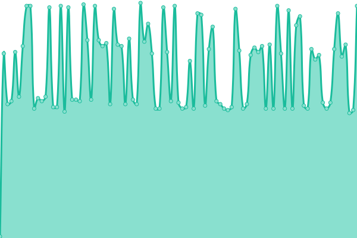 185ms
     
 | 

<a href="https://status.mainssh.com/history/frlgrpc-mainssh-xyz">99.11%</a>
    

|  [frmgrpc.mainssh.xyz](frmgrpc.mainssh.xyz) | 🟩 Up | [frmgrpc-mainssh-xyz.yml](https://github.com/serversshnet/status-mainssh.com/commits/HEAD/history/frmgrpc-mainssh-xyz.yml) | 

 196ms
     
 | 

<a href="https://status.mainssh.com/history/frmgrpc-mainssh-xyz">99.43%</a>
    

|  [ukm.mainssh.com](ukm.mainssh.com) | 🟩 Up | [ukm-mainssh-com.yml](https://github.com/serversshnet/status-mainssh.com/commits/HEAD/history/ukm-mainssh-com.yml) | 

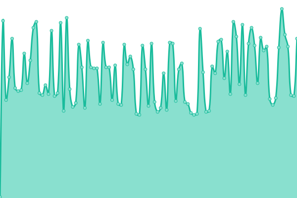 125ms
     
 | 

<a href="https://status.mainssh.com/history/ukm-mainssh-com">97.48%</a>
    

|  [dem.mainssh.com](dem.mainssh.com) | 🟥 Down | [dem-mainssh-com.yml](https://github.com/serversshnet/status-mainssh.com/commits/HEAD/history/dem-mainssh-com.yml) | 

 158ms
     
 | 

<a href="https://status.mainssh.com/history/dem-mainssh-com">97.13%</a>
    

|  [frm.mainssh.com](frm.mainssh.com) | 🟥 Down | [frm-mainssh-com.yml](https://github.com/serversshnet/status-mainssh.com/commits/HEAD/history/frm-mainssh-com.yml) | 

 0ms
     
 | 

<a href="https://status.mainssh.com/history/frm-mainssh-com">0.00%</a>
    

|  [cam.mainssh.com](cam.mainssh.com) | 🟥 Down | [cam-mainssh-com.yml](https://github.com/serversshnet/status-mainssh.com/commits/HEAD/history/cam-mainssh-com.yml) | 

 0ms
     
 | 

<a href="https://status.mainssh.com/history/cam-mainssh-com">0.00%</a>
    

|  [sgm3.mainssh.com](sgm3.mainssh.com) | 🟩 Up | [sgm3-mainssh-com.yml](https://github.com/serversshnet/status-mainssh.com/commits/HEAD/history/sgm3-mainssh-com.yml) | 

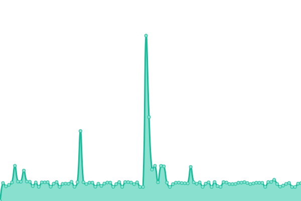 219ms
     
 | 

<a href="https://status.mainssh.com/history/sgm3-mainssh-com">74.94%</a>
    

|  [sgm2.mainssh.com](sgm2.mainssh.com) | 🟩 Up | [sgm2-mainssh-com.yml](https://github.com/serversshnet/status-mainssh.com/commits/HEAD/history/sgm2-mainssh-com.yml) | 

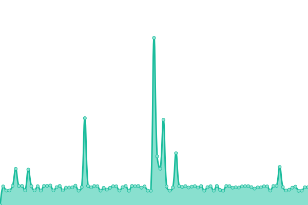 221ms
     
 | 

<a href="https://status.mainssh.com/history/sgm2-mainssh-com">0.00%</a>
    

|  [sgm1.mainssh.com](sgm1.mainssh.com) | 🟩 Up | [sgm1-mainssh-com.yml](https://github.com/serversshnet/status-mainssh.com/commits/HEAD/history/sgm1-mainssh-com.yml) | 

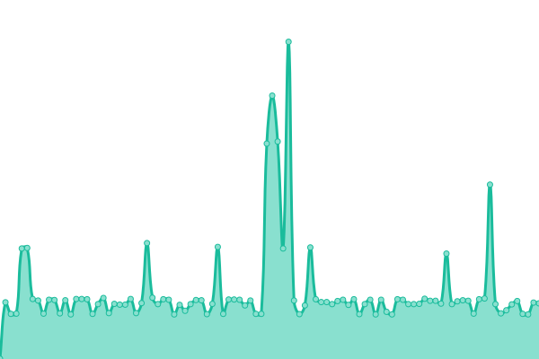 217ms
     
 | 

<a href="https://status.mainssh.com/history/sgm1-mainssh-com">100.00%</a>
    

|  [hktgrpc.mainssh.xyz](hktgrpc.mainssh.xyz) | 🟩 Up | [hktgrpc-mainssh-xyz.yml](https://github.com/serversshnet/status-mainssh.com/commits/HEAD/history/hktgrpc-mainssh-xyz.yml) | 

 211ms
     
 | 

<a href="https://status.mainssh.com/history/hktgrpc-mainssh-xyz">100.00%</a>
    

|  [hktws.mainssh.xyz](hktws.mainssh.xyz) | 🟩 Up | [hktws-mainssh-xyz.yml](https://github.com/serversshnet/status-mainssh.com/commits/HEAD/history/hktws-mainssh-xyz.yml) | 

 212ms
     
 | 

<a href="https://status.mainssh.com/history/hktws-mainssh-xyz">100.00%</a>
    

|  [hktcp.mainssh.xyz](hktcp.mainssh.xyz) | 🟩 Up | [hktcp-mainssh-xyz.yml](https://github.com/serversshnet/status-mainssh.com/commits/HEAD/history/hktcp-mainssh-xyz.yml) | 

 213ms
     
 | 

<a href="https://status.mainssh.com/history/hktcp-mainssh-xyz">100.00%</a>
    

|  [hklgrpc.mainssh.xyz](hklgrpc.mainssh.xyz) | 🟩 Up | [hklgrpc-mainssh-xyz.yml](https://github.com/serversshnet/status-mainssh.com/commits/HEAD/history/hklgrpc-mainssh-xyz.yml) | 

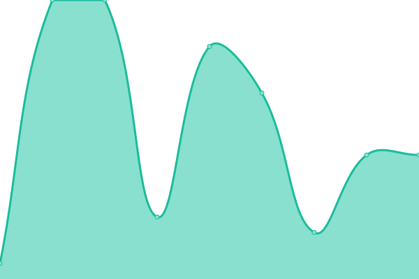 224ms
     
 | 

<a href="https://status.mainssh.com/history/hklgrpc-mainssh-xyz">100.00%</a>
    

|  [hkmgrpc.mainssh.xyz](hkmgrpc.mainssh.xyz) | 🟩 Up | [hkmgrpc-mainssh-xyz.yml](https://github.com/serversshnet/status-mainssh.com/commits/HEAD/history/hkmgrpc-mainssh-xyz.yml) | 

 214ms
     
 | 

<a href="https://status.mainssh.com/history/hkmgrpc-mainssh-xyz">100.00%</a>
    

|  [hkmws.mainssh.xyz](hkmws.mainssh.xyz) | 🟩 Up | [hkmws-mainssh-xyz.yml](https://github.com/serversshnet/status-mainssh.com/commits/HEAD/history/hkmws-mainssh-xyz.yml) | 

 227ms
     
 | 

<a href="https://status.mainssh.com/history/hkmws-mainssh-xyz">100.00%</a>
    

|  [sg3tgrpc.mainssh.xyz](sg3tgrpc.mainssh.xyz) | 🟩 Up | [sg3tgrpc-mainssh-xyz.yml](https://github.com/serversshnet/status-mainssh.com/commits/HEAD/history/sg3tgrpc-mainssh-xyz.yml) | 

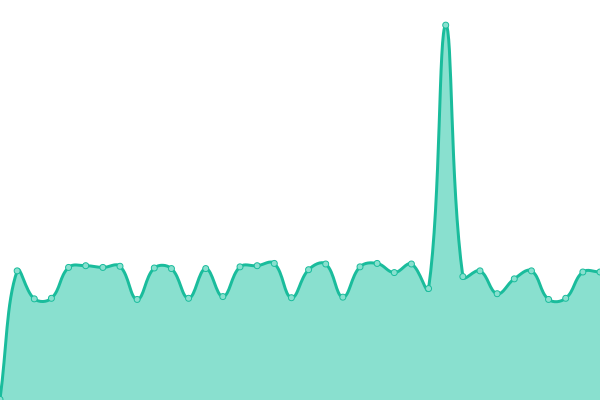 218ms
     
 | 

<a href="https://status.mainssh.com/history/sg3tgrpc-mainssh-xyz">93.02%</a>
    

|  [sg2tgrpc.mainssh.xyz](sg2tgrpc.mainssh.xyz) | 🟩 Up | [sg2tgrpc-mainssh-xyz.yml](https://github.com/serversshnet/status-mainssh.com/commits/HEAD/history/sg2tgrpc-mainssh-xyz.yml) | 

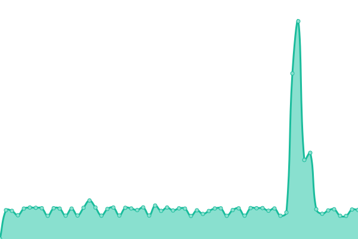 216ms
     
 | 

<a href="https://status.mainssh.com/history/sg2tgrpc-mainssh-xyz">84.81%</a>
    

|  [sg3tws.mainssh.xyz](sg3tws.mainssh.xyz) | 🟩 Up | [sg3tws-mainssh-xyz.yml](https://github.com/serversshnet/status-mainssh.com/commits/HEAD/history/sg3tws-mainssh-xyz.yml) | 

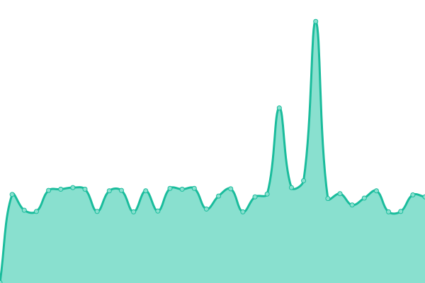 216ms
     
 | 

<a href="https://status.mainssh.com/history/sg3tws-mainssh-xyz">93.05%</a>
    

|  [sg2tws.mainssh.xyz](sg2tws.mainssh.xyz) | 🟩 Up | [sg2tws-mainssh-xyz.yml](https://github.com/serversshnet/status-mainssh.com/commits/HEAD/history/sg2tws-mainssh-xyz.yml) | 

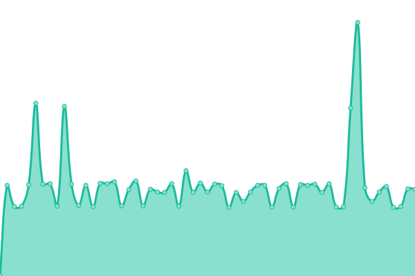 216ms
     
 | 

<a href="https://status.mainssh.com/history/sg2tws-mainssh-xyz">84.83%</a>
    

|  [sg3lgrpc.mainssh.xyz](sg3lgrpc.mainssh.xyz) | 🟩 Up | [sg3lgrpc-mainssh-xyz.yml](https://github.com/serversshnet/status-mainssh.com/commits/HEAD/history/sg3lgrpc-mainssh-xyz.yml) | 

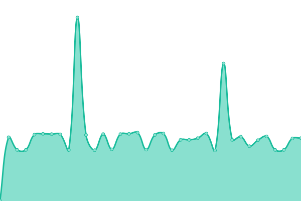 216ms
     
 | 

<a href="https://status.mainssh.com/history/sg3lgrpc-mainssh-xyz">93.07%</a>
    

|  [sg2lgrpc.mainssh.xyz](sg2lgrpc.mainssh.xyz) | 🟩 Up | [sg2lgrpc-mainssh-xyz.yml](https://github.com/serversshnet/status-mainssh.com/commits/HEAD/history/sg2lgrpc-mainssh-xyz.yml) | 

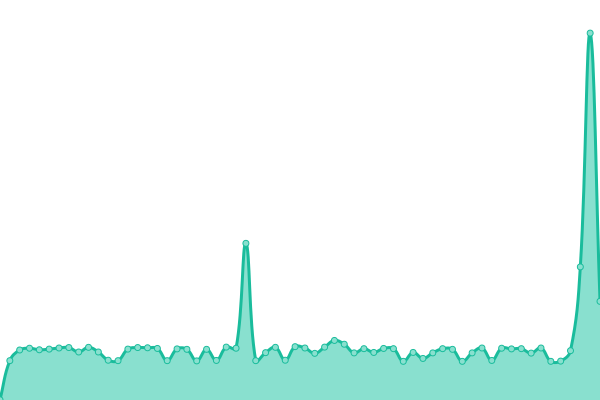 220ms
     
 | 

<a href="https://status.mainssh.com/history/sg2lgrpc-mainssh-xyz">84.86%</a>
    

|  [sg3mws.mainssh.xyz](sg3mws.mainssh.xyz) | 🟩 Up | [sg3mws-mainssh-xyz.yml](https://github.com/serversshnet/status-mainssh.com/commits/HEAD/history/sg3mws-mainssh-xyz.yml) | 

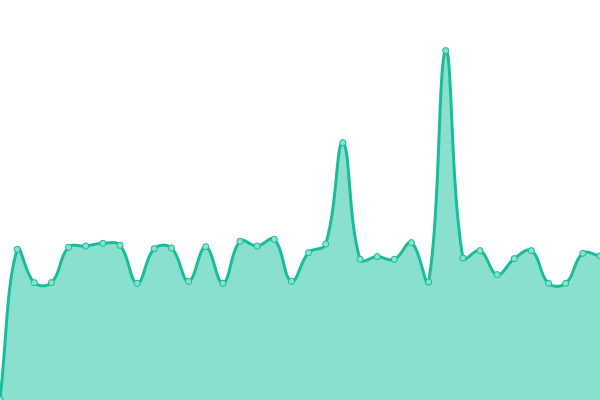 219ms
     
 | 

<a href="https://status.mainssh.com/history/sg3mws-mainssh-xyz">93.10%</a>
    

|  [sg2mws.mainssh.xyz](sg2mws.mainssh.xyz) | 🟩 Up | [sg2mws-mainssh-xyz.yml](https://github.com/serversshnet/status-mainssh.com/commits/HEAD/history/sg2mws-mainssh-xyz.yml) | 

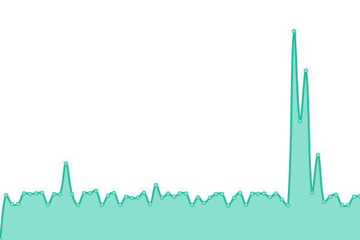 217ms
     
 | 

<a href="https://status.mainssh.com/history/sg2mws-mainssh-xyz">84.91%</a>
    

|  [sg3tcp.mainssh.xyz](sg3tcp.mainssh.xyz) | 🟩 Up | [sg3tcp-mainssh-xyz.yml](https://github.com/serversshnet/status-mainssh.com/commits/HEAD/history/sg3tcp-mainssh-xyz.yml) | 

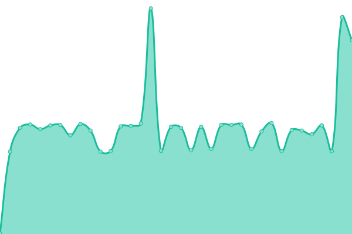 221ms
     
 | 

<a href="https://status.mainssh.com/history/sg3tcp-mainssh-xyz">93.15%</a>
    

|  [sg2tcp.mainssh.xyz](sg2tcp.mainssh.xyz) | 🟩 Up | [sg2tcp-mainssh-xyz.yml](https://github.com/serversshnet/status-mainssh.com/commits/HEAD/history/sg2tcp-mainssh-xyz.yml) | 

 218ms
     
 | 

<a href="https://status.mainssh.com/history/sg2tcp-mainssh-xyz">84.94%</a>
    

|  [sg3mgrpc.mainssh.xyz](sg3mgrpc.mainssh.xyz) | 🟩 Up | [sg3mgrpc-mainssh-xyz.yml](https://github.com/serversshnet/status-mainssh.com/commits/HEAD/history/sg3mgrpc-mainssh-xyz.yml) | 

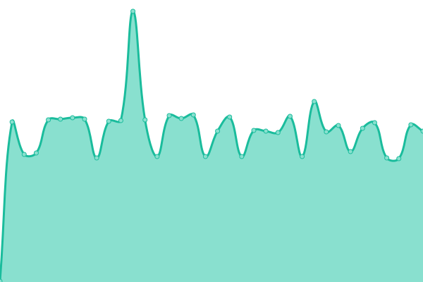 221ms
     
 | 

<a href="https://status.mainssh.com/history/sg3mgrpc-mainssh-xyz">93.17%</a>
    

|  [sg2mgrpc.mainssh.xyz](sg2mgrpc.mainssh.xyz) | 🟩 Up | [sg2mgrpc-mainssh-xyz.yml](https://github.com/serversshnet/status-mainssh.com/commits/HEAD/history/sg2mgrpc-mainssh-xyz.yml) | 

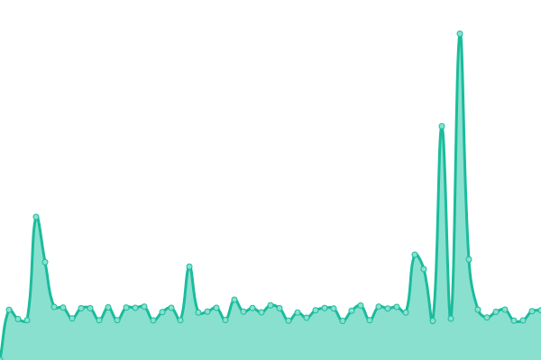 216ms
     
 | 

<a href="https://status.mainssh.com/history/sg2mgrpc-mainssh-xyz">84.96%</a>
    

|  [idtgrpc.mainssh.xyz](idtgrpc.mainssh.xyz) | 🟩 Up | [idtgrpc-mainssh-xyz.yml](https://github.com/serversshnet/status-mainssh.com/commits/HEAD/history/idtgrpc-mainssh-xyz.yml) | 

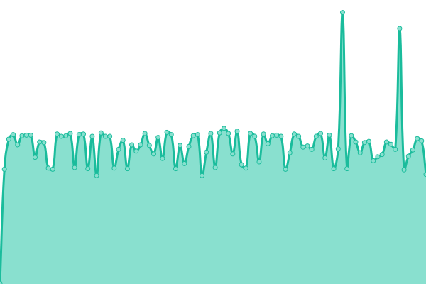 228ms
     
 | 

<a href="https://status.mainssh.com/history/idtgrpc-mainssh-xyz">97.18%</a>
    

|  [idtws.mainssh.xyz](idtws.mainssh.xyz) | 🟩 Up | [idtws-mainssh-xyz.yml](https://github.com/serversshnet/status-mainssh.com/commits/HEAD/history/idtws-mainssh-xyz.yml) | 

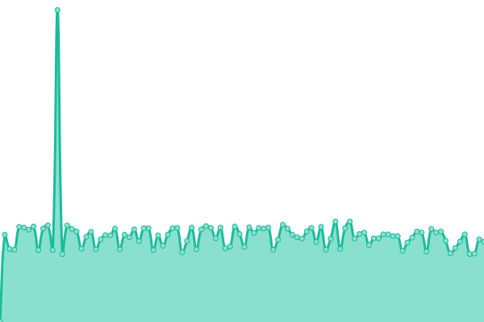 230ms
     
 | 

<a href="https://status.mainssh.com/history/idtws-mainssh-xyz">97.19%</a>
    

|  [idtcp.mainssh.xyz](idtcp.mainssh.xyz) | 🟩 Up | [idtcp-mainssh-xyz.yml](https://github.com/serversshnet/status-mainssh.com/commits/HEAD/history/idtcp-mainssh-xyz.yml) | 

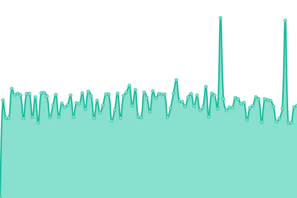 236ms
     
 | 

<a href="https://status.mainssh.com/history/idtcp-mainssh-xyz">97.20%</a>
    

|  [idlgrpc.mainssh.xyz](idlgrpc.mainssh.xyz) | 🟩 Up | [idlgrpc-mainssh-xyz.yml](https://github.com/serversshnet/status-mainssh.com/commits/HEAD/history/idlgrpc-mainssh-xyz.yml) | 

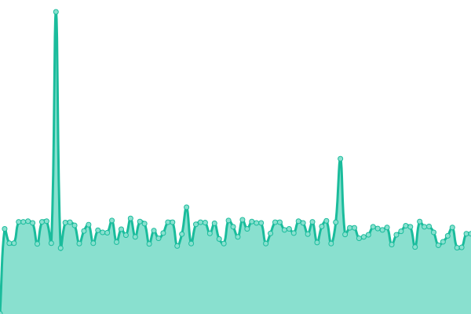 230ms
     
 | 

<a href="https://status.mainssh.com/history/idlgrpc-mainssh-xyz">97.21%</a>
    

|  [idmgrpc.mainssh.xyz](idmgrpc.mainssh.xyz) | 🟩 Up | [idmgrpc-mainssh-xyz.yml](https://github.com/serversshnet/status-mainssh.com/commits/HEAD/history/idmgrpc-mainssh-xyz.yml) | 

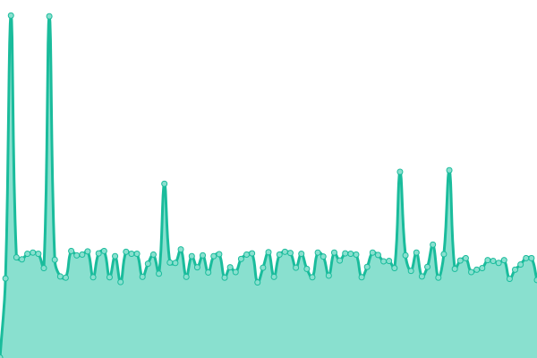 229ms
     
 | 

<a href="https://status.mainssh.com/history/idmgrpc-mainssh-xyz">97.23%</a>
    

|  [idmws.mainssh.xyz](idmws.mainssh.xyz) | 🟩 Up | [idmws-mainssh-xyz.yml](https://github.com/serversshnet/status-mainssh.com/commits/HEAD/history/idmws-mainssh-xyz.yml) | 

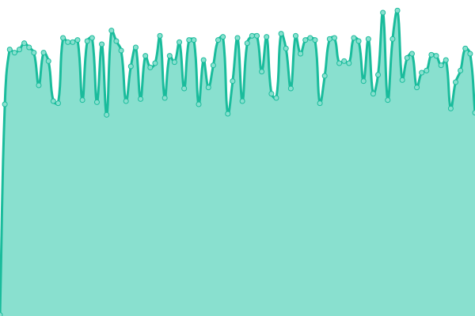 230ms
     
 | 

<a href="https://status.mainssh.com/history/idmws-mainssh-xyz">97.24%</a>
    

|  [sgtws.mainssh.xyz](sgtws.mainssh.xyz) | 🟩 Up | [sgtws-mainssh-xyz.yml](https://github.com/serversshnet/status-mainssh.com/commits/HEAD/history/sgtws-mainssh-xyz.yml) | 

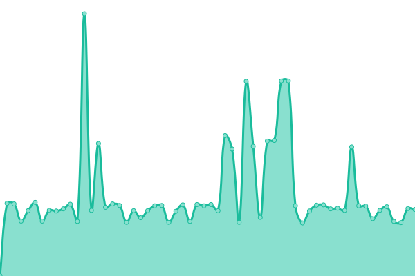 216ms
     
 | 

<a href="https://status.mainssh.com/history/sgtws-mainssh-xyz">90.95%</a>
    

|  [sglgrpc.mainssh.xyz](sglgrpc.mainssh.xyz) | 🟩 Up | [sglgrpc-mainssh-xyz.yml](https://github.com/serversshnet/status-mainssh.com/commits/HEAD/history/sglgrpc-mainssh-xyz.yml) | 

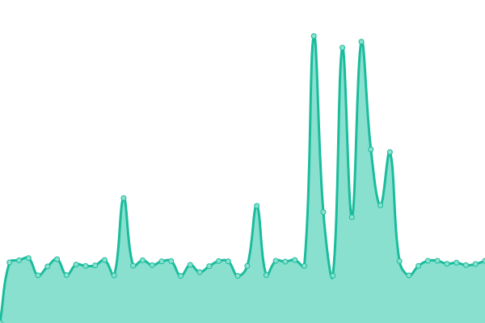 225ms
     
 | 

<a href="https://status.mainssh.com/history/sglgrpc-mainssh-xyz">90.97%</a>
    

|  [sgmws.mainssh.xyz](sgmws.mainssh.xyz) | 🟩 Up | [sgmws-mainssh-xyz.yml](https://github.com/serversshnet/status-mainssh.com/commits/HEAD/history/sgmws-mainssh-xyz.yml) | 

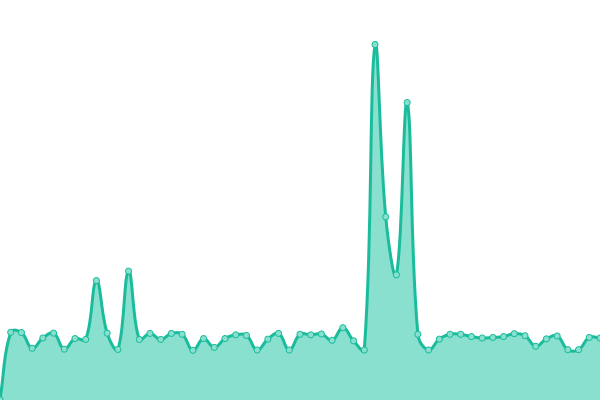 222ms
     
 | 

<a href="https://status.mainssh.com/history/sgmws-mainssh-xyz">90.98%</a>
    

|  [sgmgrpc.mainssh.xyz](sgmgrpc.mainssh.xyz) | 🟩 Up | [sgmgrpc-mainssh-xyz.yml](https://github.com/serversshnet/status-mainssh.com/commits/HEAD/history/sgmgrpc-mainssh-xyz.yml) | 

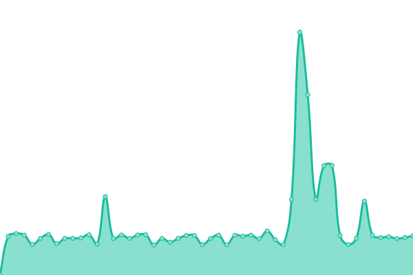 223ms
     
 | 

<a href="https://status.mainssh.com/history/sgmgrpc-mainssh-xyz">90.99%</a>
    

|  [sgtgrpc.mainssh.xyz](sgtgrpc.mainssh.xyz) | 🟩 Up | [sgtgrpc-mainssh-xyz.yml](https://github.com/serversshnet/status-mainssh.com/commits/HEAD/history/sgtgrpc-mainssh-xyz.yml) | 

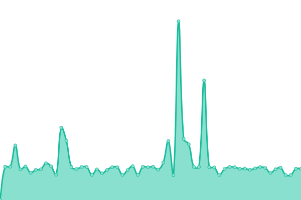 219ms
     
 | 

<a href="https://status.mainssh.com/history/sgtgrpc-mainssh-xyz">91.00%</a>
    

|  [sgtcp.mainssh.xyz](sgtcp.mainssh.xyz) | 🟩 Up | [sgtcp-mainssh-xyz.yml](https://github.com/serversshnet/status-mainssh.com/commits/HEAD/history/sgtcp-mainssh-xyz.yml) | 

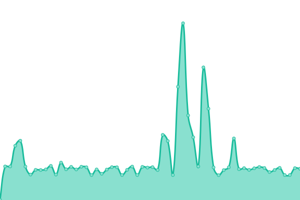 219ms
     
 | 

<a href="https://status.mainssh.com/history/sgtcp-mainssh-xyz">91.02%</a>
    

<!--end: status pages-->

[**Visit our status website →**](https://demo.upptime.js.org)

## 📄 License

- Powered by: [Upptime](https://github.com/upptime/upptime)
- Code: [MIT](./LICENSE) © [serversshne](https://demo.upptime.js.org)
- Data in the `./history` directory: [Open Database License](https://opendatacommons.org/licenses/odbl/1-0/)
